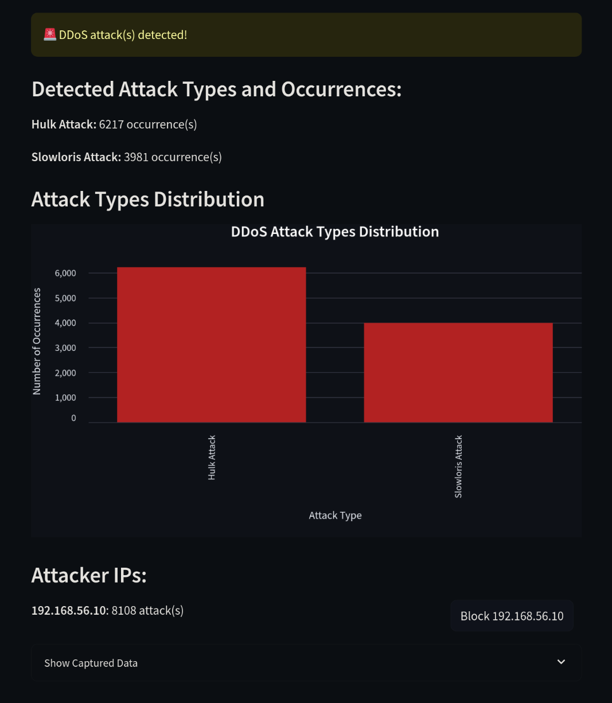
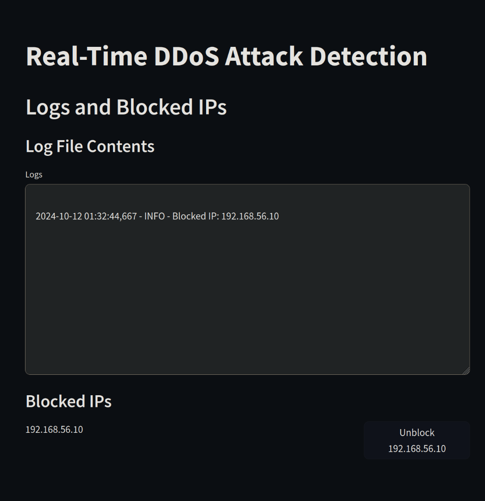

# GuardNet: A Real-Time ML-Based Intrusion Detection System

GuardNet is a machine learning-based Intrusion Detection System (IDS) designed to detect Distributed Denial of Service (DDoS) attacks in real time. It utilizes Random Forest for classification, CICFlowMeter for data collection, and Streamlit for real-time monitoring, logging, and user interaction.

## Table of Contents
- [Features](#features)
- [Installation](#installation)
- [Usage](#usage)
- [Project Structure](#project-structure)
- [Model Overview](#model-overview)
- [Scalability](#scalability)
- [License](#license)
- [Tools](#tools)

## Features
- **Real-Time Monitoring and logging**: Detects DDoS attacks (Hulk and Slowloris) in real-time using a trained Random Forest model ( To add more attacks/data read [Scalability](#scalability) )
- **Manual IP Blocking**: Allows users to manually block and unblock detected malicious IP addresses.
- **Streamlit Interface**: Provides a user-friendly interface for monitoring network traffic and viewing detection results.
- **Open Source**: Designed for easy customization and expansion.

## Installation

1. **Clone the repository**:
    ```bash
    git clone https://github.com/p0tat003-hex/guardnet.git
    cd guardnet
    ```

2. **Install dependencies**:
    ```bash
    pip install -r requirements.txt
    ```

3. **Download and set up CICFlowMeter**:
    - Follow the instructions at [CICFlowMeter (python version)](https://github.com/datthinh1801/cicflowmeter)  to set up CICFlowMeter for network traffic analysis.

4. **Download the trained model**:
    - Place your `model.pkl` and `scaler.pkl` files in the `models/` directory.

## Usage

1. **Start the Streamlit Application**:
    ```bash
    streamlit run app.py
    ```

    Screenshots from Streamlit:

    

    <br/>

    


2. **Capture Network Traffic**:
   - Use CICFlowMeter to capture network traffic on an interface and save it as a CSV file.
   - Specify the CSV path in the Streamlit interface for real-time monitoring.

3. **Monitor and Block Attacks**:
   - View the detected traffic in the Streamlit dashboard.
   - Manually block/unblock malicious IP addresses using the provided interface.

## Project Structure
```
guardnet/
├── models/                 # Directory containing trained model and scaler
│   ├── model.pkl
│   └── scaler.pkl
│
├── Outputs/                # Directory for output CSV files from CICFlowMeter
│
├── app.py                  # Main Streamlit application
│
├── app.log                 # Main Logging file
|
├── requirements.txt        # Python dependencies
│
├── README.md               # Project README file
│
└── Model_training.ipynb   # Script for data preprocessing and model training
```

## Model Overview

- **Random Forest Classifier**: Trained to classify network traffic as normal, Hulk attack, or Slowloris attack.
- **Data Collection**: Uses CICFlowMeter to extract flow-based features from network traffic and saves them as CSV files.
- **Data Preprocessing**: Scales features using `StandardScaler` and removes unnecessary columns before training.


## Scalability
If you wish to add more attacks to the IDS or collect your own data.

### Step 1: Collect Additional Network Traffic with CICFlowMeter
1. **Install [CICFlowMeter (python version)](https://github.com/datthinh1801/cicflowmeter)**
2. **Capture network traffic** from the target environment:
   - Use CICFlowMeter to monitor network interfaces and capture traffic, the traffic will be saved as a CSV file that will be used for your model training.
   ```bash
    sudo cicflowmeter -i [interface] -c [output.csv]
    ```
   - Simulate different types of traffic, including normal network activity and additional attack scenarios if desired (e.g., other types of DDoS attacks).


> I did this by running a virtual machine ( Ubuntu live server ) on a different network and simulating the attack on the main machine's Apache local webserver.


### Step 2: Preprocess the New CSV File for Model Training
1. **Label the new data**:
   - Assign labels to the captured data (e.g., `0` for normal traffic, `1` for a new attack type).
2. **Ensure consistent feature set**:
   - Make sure the new CSV file has the same feature columns as the existing training data. Add any missing columns if needed, in my project I dropped the `ip_src` , `ip_dst` and `timestamp`.
3. **Clean the data**:
   - Handle any missing values or outliers in the new dataset by filling in missing values or removing problematic rows.
4. **Combine the new data with the existing dataset**:
   - Merge the new CSV file with the current dataset to form an expanded training dataset.

### Step 3: Retrain the Machine Learning Model
1. **Split the expanded dataset** into training and testing sets, typically using a 70/30 or 80/20 split.
2. **Standardize the features** using the `StandardScaler` or a similar method to scale the data.
3. **Train the Random Forest model** on the new training set:
   - Use the combined dataset to train the model and validate its performance on the testing set.
   - Evaluate the model using metrics such as accuracy, precision, recall, and F1-score to ensure it performs well on the new data.
4. **Fine-tune the model** as needed:
   - Adjust hyperparameters or try different machine learning algorithms if the performance does not meet expectations.

### Step 4: Deploy the Updated Model
1. **Save the updated model and scaler** to the `models/` directory (e.g., `model.pkl` and `scaler.pkl`).
2. **Update the Streamlit application** to use the new model:
   - Make sure the Streamlit app points to the latest version of the trained model and any new configurations.


## License

This project is licensed under the MIT License. See the [LICENSE](LICENSE) file for details.

## Tools

- [CICFlowMeter (python)](https://github.com/datthinh1801), Original: [CICFlowMeter](https://github.com/ISCX/CICFlowMeter), [Reference](https://www.unb.ca/cic/research/applications.html#CICFlowMeter)
- [Scikit-Learn](https://scikit-learn.org/)
- [Streamlit](https://streamlit.io/)
